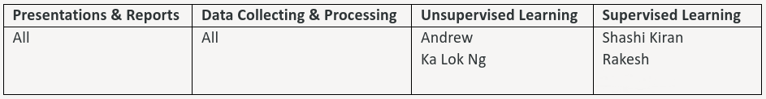
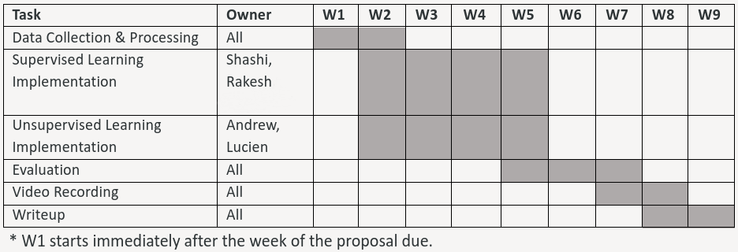

# Paper Acceptance Prediction

## Team 10 Group Members
- Andrew Chafos
- Shashi Kiran Meda Ravi
- Ramesha Rakesh Mugaludi
- Ka Lok Ng

## Introduction
The number of paper submissions in ML conferences is on the rise and outpacing the availability of good reviewers to evaluate them. Having a reliable way to quantify a paper's quality in terms of probability of acceptance could allow one to better allocate the papers among reviewers while also having a better metric for desk rejection of poor-quality papers. Additionally, such a model could also be used to aid authors to instantly evaluate and subsequently improve their paper’s chances of acceptance. Self-evaluation could also discourage authors from submitting poor-quality papers, hence leading to better quality paper submissions overall. Hence, such a model could have double benefits in terms of supporting the scientific community.

Besides the hard-to-measure aspects such as the novelty and the quality of research, many other measurable factors play a vital role in the paper review process. Good presentation is necessary for reviewers to appreciate the papers. The popularity of the paper's research sub-domain may also affect its acceptance.

The number of paper submissions in ML conferences has outpaced the capacity of reviewers. Since there is no reliable metric to quantify the possibility of acceptance of a paper in advance, many papers often get rejected due to a hasty submission with low quality or interest mismatch to reviewers or a target conference. We propose a machine learning project that enables authors to self-evaluate the quality of their papers in acceptance probability
based on prior submissions to some top-tier ML conferences and their corresponding reviews.

Reviewers evaluate diverse aspects of a paper. Not to mention its novelty and writing quality,they also account for visual representations of the submitted paper. Besides, accepted papers usually reflect the contemporary research trend in the domain. Unlike similar works, we additionally reflect these features in our estimating model that gauges the acceptance possibility of the paper.

Previously, Joshi et al. [2] and J. Huang et al. [5] developed supervised learning models to predict paper acceptance. Dong et al. [3] attempted predicting a paper's the h-index. Wang et al. [4] built models for generating review comments and scores for papers. 

## Problem Definition
We aim to build a predictive model to output a paper’s chance of acceptance. Further, we also aim to discern the prominent factors affecting a paper’s acceptance in each research domain. 
## Dataset
### Data Collection 
We gathered data for acceptance prediction from the PeerRead dataset [1] containing PDFs and parsed JSON files containing the metadata as well as reviews of papers from 6 venues: the ACL 2017 conference, a sample of Machine Learning arXiv papers from 2007-2017 across 3 domains (Machine Learning, Computation and Language, and Artificial Intelligence), the CONLL 2016 conference, and the ICLR 2017 conference. There are 11,090 datapoints across all training data from the conferences as well as 637 datapoints across all testing data from the conferences, with each datapoint corresponding to a paper.
### Text-based acceptance prediction
Once the JSON data was loaded, we constructed a Pandas dataframe for each conference. Each row of each dataframe represents a paper from a particular conference, and each column corresponds to a feature whose value is calculated based on the metadata and review data. Below is an excerpt from one such dataframe, which corresponds to the database of arXiv Computer Science AI papers from 2007 to 2017. Each dataframe currently has 7 features (the 7 right-most columns), but we plan to add more. Additionally, we created a dataframe representing the labels for the papers of each conference: a boolean label whose value is True when the paper was accepted and False when it was not. We found that acceptance data was only immediately available for the 3 arXiv and ICLR datasets, meaning that these will be the focus of text-based acceptance prediction. When proceeding to text-based acceptance prediction, we will merge the testing and training dataframes and programmatically create our own testing and training divisions within the datasets.


**<u>Feature Descriptions</u>**


### Image-based acceptance prediction 

Like the data collection for text-based prediction, we used the PeerRead dataset as "meta-data" for the papers' titles and acceptance. Inside PeerRead, we particularly use the papers from ICLR and arXiv.org e-Print achieve since they have fewer technical barriers, e.g., access control and rate-limiting, for crawling. 

We downloaded the raw PDF files of the papers on these venues, where <2% of PDFs are missed, probably revoked by the authors. We have no choice but to remove these papers from our dataset.  

The resulting data is >10GB and beyond our capacity for model training. To subsample the PDFs, we convert them into PNG images via pdf2image and then extract and merge the first 4 pages of each paper into a 224x244 image since we deem the first few pages are the most influential ones to the reviewers' impression. Also, it is hard to uniformly capture all pages because the numbers of pages are different, depending on the format requirement of the venues and the length of the appendix.   

The following is an example of the extracted images. The resolution is low but should be enough as J. Huang[1] 's image-based approach works well with images of the same resolution.

<center></center>

### Sub-domain classification 

We are using unsupervised learning methods to discover the sub-domain of a paper and cluster similar domains together. We will be using techniques like Bag of words, TF-IDF, and BERT encoding to cluster the papers based on the sub-domain. Till now, we have created Bag-of-words and TF-IDF encoding using the words from "Title", and "Abstract" of papers from our PeerRead Dataset.

## Methods
Our main idea is to capture the wordings in papers as features, most likely using natural language processing (NLP) techniques to transform the paper contents into (word embedding) vectors. Furthermore, we will combine them with some "meta-data" of the papers, e.g., the citations, the number of figures/equations, etc.

### Unsupervised Learning
**Unsupervised learning** techniques would help us discover similar sub-domains and recent popular research trends by performing clustering based on inclusion of keywords related to specific sub-domains. We use k-means clustering techniques to identify sub-domains by using various feature representations as follows

1. Bag-of-words (BOW)
2. Term Frequency–Inverse Document Frequency (TF-IDF)
3. Bidirectional Encoder Representations from Transformers (BERT)

We have implemented Bag-of-words, TF-IDF and BERT encoding using words from ‘Title’, and ‘Abstract’ sections of the paper. We are using scikit’s feature_extraction libraries to construct our BOW and TF-IDF encodings. 

### Bag-of-words (BOW)

We chose this model because it is the simplest numerical  representation of text. For constructing this, we are using scikit’s  CountVectorizer to tokenize the sentences from ‘Title’ and ‘Abstract’  into a matrix of token counts. Then we are using scikit’s  fit_transform() api to learn the vocabulary dictionary and return the  document-term matrix. We are using pandas dataframes to store this  matrix.

During preprocessing the data, we are excluding English stop words  and numbers from tokenizing because they do not contribute for analyzing the sub-domain.

There are total 11727 papers, including both training and testing data, and the encoding resulted in 29445 unique words. A sample of our BOW table is as follows:

```py
# Getting bag of words data structure
CountVec = CountVectorizer(ngram_range=(1,1), stop_words='english')
Count_data = CountVec.fit_transform(merged_data)
cv_dataframe=pd.DataFrame(Count_data.toarray(),columns=CountVec.get_feature_names_out())
pd.set_option('display.max_colwidth', None)
pd.set_option('display.max_rows', None)
display(cv_dataframe.head(5).loc[:,cv_dataframe.head(5).any()])

# Dimension reduction on BOW using SVD
svd = TruncatedSVD(n_components=500, n_iter=10, random_state=42)
svd.fit(Count_data)
X_new = svd.transform(Count_data)
X_train = X_new[0:len(train_data)]
X_test = X_new[len(train_data):]
```

As we can see, there are total 11727 papers, including both training and testing data, and the encoding resulted in 29445 unique words. 

A sample of our BOW table is as follows:

|      | annotation | answering | attention | base | based | bridge | cross | detection | effective | embedding |
| ---: | ---------: | --------: | --------: | ---: | ----: | -----: | ----: | --------: | --------: | --------: |
|    0 |          0 |         0 |         0 |    0 |     0 |      1 |     0 |         0 |         0 |         1 |
|    1 |          0 |         0 |         1 |    0 |     0 |      0 |     0 |         0 |         0 |         0 |
|    2 |          1 |         0 |         0 |    0 |     0 |      0 |     1 |         0 |         1 |         0 |
|    3 |          0 |         0 |         0 |    0 |     1 |      0 |     0 |         0 |         0 |         0 |
|    4 |          0 |         1 |         0 |    1 |     0 |      0 |     0 |         1 |         0 |         0 |

### Dimensionality Reduction

Initially we clustered similar papers together by considering both  Title and Abstract sections of the papers for encoding and clustering.  The total number of unique words resulted in 29445 which is the number  of features in this case. As you can already tell, this is a lot of  features and we have to reduce them better and faster clustering.

We have tried out the following ways to overcome this problem and  will be continuing with these approach for all clustering/encoding  methods: 

#### Just use Title of the paper for clustering

By doing this our features drastically reduced to 9172 unique words  which is very reasonable for clustering. In this case we don't even have to explicitly use dimension reduction techniques because this is  computationally reasonable and also lesser than the number of samples we have.

#### Singular Value Decomposition (SVD)

Alternatively, we also experimented using SVD for dimension reduction. In this case as well, we considered words from the Title of  the papers because after exploring with and without Abstract we could  see that Title alone is reasonably sufficient for clustering similar  papers together. One big advantage of excluding Abstract now is that we  can further reduce the number of features much lesser than 9172 unique  words we have from the Title.

### Clustering on BOW model

Now, we will be using the BOW encoding for clustering similar  sub-domain papers together. For this we are using K-means clustering  algorithm and we are determining the optimal number of clusters using  the popular elbow curve method.

#### Without SVD

From the below elbow curve, we are choosing *𝐾*=6 as the optimal number of clusters for our final clustering model.


Inertia which is sum of squared distances of samples to their closest cluster center is also obtained once the training is done. Inertia in this case is 71404.58780199478.

#### With SVD

From the below elbow curve, we are choosing *𝐾*=6 as the optimal number of clusters for our final clustering model.


Inertia in this case is 44204.41325844073.

### Clustering Analysis
#### Without SVD
To understand what each cluster signifies in terms of sub-domain, we are obtaining top terms per cluster. To analyze in a better way, word clouds for these are generated.
<center></center>
<center></center>
<center></center>
<center></center>
<center></center>
<center></center>

Once the model is trained, we are clustering the papers in our testing set and the sample prediction is as shown below.

|      | Title                                                        | Cluster ID |
| ---: | :----------------------------------------------------------- | ---------: |
|    0 | Evaluation Metrics for Machine Reading Comprehension: Prerequisite Skills and Readability |          1 |
|    1 | A Neural Local Coherence Model                               |          2 |
|    2 | Neural Modeling of Multi-Predicate Interactions for Japanese Predicate Argument Structure Analysis |          2 |
|    3 | Neural Disambiguation of Causal Lexical Markers based on Context |          2 |
|    4 | Chunk-based Decoder for Neural Machine Translation           |          3 |
|    5 | What do Neural Machine Translation Models Learn about Morphology? |          3 |
|    6 | Detecting Lexical Entailment in Context                      |          1 |
|    7 | Support Vector Machine Classification with Indefinite Kernels |          1 |
|    8 | The Parameterized Complexity of Global Constraints           |          1 |
|    9 | Examples as Interaction: On Humans Teaching a Computer to Play a Game |          1 |

#### With SVD
Now, clustering on BOW by reducing the number of features to 500 using SVD, the following is the sample prediction:

|      | Title                                                        | Cluster ID |
| ---: | :----------------------------------------------------------- | ---------: |
|    0 | Evaluation Metrics for Machine Reading Comprehension: Prerequisite Skills and Readability |          1 |
|    1 | A Neural Local Coherence Model                               |          3 |
|    2 | Neural Modeling of Multi-Predicate Interactions for Japanese Predicate Argument Structure Analysis |          3 |
|    3 | Neural Disambiguation of Causal Lexical Markers based on Context |          2 |
|    4 | Chunk-based Decoder for Neural Machine Translation           |          2 |
|    5 | What do Neural Machine Translation Models Learn about Morphology? |          3 |
|    6 | Detecting Lexical Entailment in Context                      |          1 |
|    7 | Support Vector Machine Classification with Indefinite Kernels |          1 |
|    8 | The Parameterized Complexity of Global Constraints           |          1 |
|    9 | Examples as Interaction: On Humans Teaching a Computer to Play a Game |          1 |

### TF-IDF Encoding

This model is a numeric statistic that is intended to reflect how  important a word is to a document. Term frequency is a measure of how  frequently a term appears in a document and IDF is a measure of how  important a term is. In contrast to BOW, this model derives information  on the most and least important words, and hence is expected to perform  better. Implementing this is like the BOW approach, except that we will  be using a different tokenizer for our data. We are using scikit’s  TfidfVectorizer with English stop-words to avoid commonly used English  words.

A sample of our TF_IDF encoding is as follows:

|      | annotation | answering | attention |     base |    based |   bridge |    cross | detection | effective | embedding |
| ---: | ---------: | --------: | --------: | -------: | -------: | -------: | -------: | --------: | --------: | --------: |
|    0 |          0 |         0 |         0 |        0 |        0 | 0.467153 |        0 |         0 |         0 |  0.299487 |
|    1 |          0 |         0 |  0.318779 |        0 |        0 |        0 |        0 |         0 |         0 |         0 |
|    2 |   0.330864 |         0 |         0 |        0 |        0 |        0 | 0.286734 |         0 |  0.330864 |         0 |
|    3 |          0 |         0 |         0 |        0 | 0.215444 |        0 |        0 |         0 |         0 |         0 |
|    4 |          0 |   0.36217 |         0 | 0.429501 |        0 |        0 |        0 |  0.306265 |         0 |         0 |

To cluster papers belonging to similar sub-domains together, we have implemented K-Means algorithm on TF-TDF encoding. 

```py
# Training the Model
# Getting tf-idf data structure
# Vectorize the text
vectorizer = TfidfVectorizer(stop_words='english')
X = vectorizer.fit_transform(merged_data)
X_train = X[0:len(train_data)]
X_test = X[len(train_data):]
tf_idf_df=pd.DataFrame(X_train.toarray(),columns=vectorizer.get_feature_names_out())
display(tf_idf_df.head(5).loc[:,tf_idf_df.head(5).any()])
```

### Clustering on TF-IDF model

Now, we will be using the TF-IDF encoding for clustering similar sub-domain papers together. For this we are using K-means clustering algorithm and we are determining the optimal number of clusters using the popular elbow curve method.

#### Without SVD
From the below elbow curve, we are choosing K=6 as the optimal number of clusters for our final clustering model.
<center></center>

Inertia which is sum of squared distances of samples to their closest cluster center is also obtained once the training is done. Inertia in this case is 10789.440479184834.

#### With SVD
From the below elbow curve, we are choosing K=6 as the optimal number of clusters for our final clustering model.
<center></center>

Inertia in this case is 5179.698138369373.

### Clustering Analysis
#### Without SVD
To understand what each cluster signifies in terms of sub-domain, we are obtaining top terms per cluster. To analyze in a better way, word clouds for these are generated.
<center></center>
<center></center>
<center></center>
<center></center>
<center></center>
<center></center>

Once the model is trained, we are clustering the papers in our testing set and the sample prediction is as shown below.

|      | Title                                                        | Cluster ID |
| ---: | :----------------------------------------------------------- | ---------: |
|    0 | Evaluation Metrics for Machine Reading Comprehension: Prerequisite Skills and Readability |          3 |
|    1 | A Neural Local Coherence Model                               |          2 |
|    2 | Neural Modeling of Multi-Predicate Interactions for Japanese Predicate Argument Structure Analysis |          0 |
|    3 | Neural Disambiguation of Causal Lexical Markers based on Context |          4 |
|    4 | Chunk-based Decoder for Neural Machine Translation           |          3 |
|    5 | What do Neural Machine Translation Models Learn about Morphology? |          3 |
|    6 | Detecting Lexical Entailment in Context                      |          0 |
|    7 | Support Vector Machine Classification with Indefinite Kernels |          3 |
|    8 | The Parameterized Complexity of Global Constraints           |          0 |
|    9 | Examples as Interaction: On Humans Teaching a Computer to Play a Game |          0 |

#### With SVD
Now, clustering on TF-IDF by reducing the number of features to 500 using SVD, the following is the sample prediction:

|      | Title                                                        | Cluster ID |
| ---: | :----------------------------------------------------------- | ---------: |
|    0 | Evaluation Metrics for Machine Reading Comprehension: Prerequisite Skills and Readability |          0 |
|    1 | A Neural Local Coherence Model                               |          4 |
|    2 | Neural Modeling of Multi-Predicate Interactions for Japanese Predicate Argument Structure Analysis |          3 |
|    3 | Neural Disambiguation of Causal Lexical Markers based on Context |          1 |
|    4 | Chunk-based Decoder for Neural Machine Translation           |          0 |
|    5 | What do Neural Machine Translation Models Learn about Morphology? |          0 |
|    6 | Detecting Lexical Entailment in Context                      |          1 |
|    7 | Support Vector Machine Classification with Indefinite Kernels |          0 |
|    8 | The Parameterized Complexity of Global Constraints           |          1 |
|    9 | Examples as Interaction: On Humans Teaching a Computer to Play a Game |          1 |

### K-Means Clustering

To decide the optimal number of clusters, we have used the elbow method.

```py
# cluster documents
distortions = []
K = range(1,15)

for k in K:
    model = KMeans(n_clusters=k, init='k-means++', max_iter=1000, n_init=10)
    model.fit(X_train)
    distortions.append(model.inertia_)

plt.plot(K, distortions)
```
<center></center>

From the above curve, we chose 6 as our optimal number of clusters and trained our model using the training dataset from TF-IDF encoding. 
```py
# Choosing the best k from elbow method.
true_k = 6
model = KMeans(n_clusters=true_k, init='k-means++', max_iter=1000, n_init=10)
model.fit(X_train)
```
These are the top terms in each cluster: 
<center></center>

Then, we used the test dataset for predicting its sub-domain cluster.
```py
# Testing the Model
# Predict the cluster association of each paper
prediction = model.predict(X_test)
print(X_train.shape)
print(X_test.shape)
df = pd.DataFrame(list(zip(test_title, prediction)), columns =['Title', 'Cluster ID'])
pd.set_option('display.max_colwidth', None)
pd.set_option('display.max_rows', None)
display(df)
```
A sample output of our clustering algorithm is as follows:

| | Title | Cluster ID |
|---:|:---------------------------------------------------------------------------------------------------|-------------:|
| 0 | Evaluation Metrics for Machine Reading Comprehension: Prerequisite Skills and Readability | 0 |
| 1 | A Neural Local Coherence Model | 1 |
| 2 | Neural Modeling of Multi-Predicate Interactions for Japanese Predicate Argument Structure Analysis | 2 |
| 3 | Neural Disambiguation of Causal Lexical Markers based on Context | 0 |
| 4 | Chunk-based Decoder for Neural Machine Translation | 3 |
| 5 | What do Neural Machine Translation Models Learn about Morphology? | 3 |
| 6 | Detecting Lexical Entailment in Context | 2 |
| 7 | Support Vector Machine Classification with Indefinite Kernels | 5 |
| 8 | The Parameterized Complexity of Global Constraints | 4 |
| 9 | Examples as Interaction: On Humans Teaching a Computer to Play a Game | 0 |

### BERT Encoding
#### Without SVD
BERT stands for Bidirectional Encoder Representations from Transformers. BERT is designed to pre-train deep bidirectional representations from unlabeled text by jointly conditioning on both left and right context in all layers. As a result, the pre-trained BERT model can be fine-tuned with just one additional output layer to create state-of-the-art models for a wide range of tasks, such as question answering and language inference, without substantial task-specific architecture modifications.

We are using sentence-transformers package which wraps the Huggingface Transformers library. For sentence, we are using a pre-trained model 'distilbert-base-nli-stsb-mean-tokens'.

We are then using this transformation for K-means clustering to group similar papers together, and as before we use elbow method to find the optimal number of clusters needed which happens to be 6 in this case.

<center></center>

The number of features after BERT encoding happens to be 768, and the total inertia for clustering is 1512914.25. <br>
The following is the sample clustering of 10 papers from our testing dataset:

|      | Title                                                        | Cluster ID |
| ---: | :----------------------------------------------------------- | ---------: |
|    0 | Evaluation Metrics for Machine Reading Comprehension: Prerequisite Skills and Readability |          5 |
|    1 | A Neural Local Coherence Model                               |          0 |
|    2 | Neural Modeling of Multi-Predicate Interactions for Japanese Predicate Argument Structure Analysis |          2 |
|    3 | Neural Disambiguation of Causal Lexical Markers based on Context |          0 |
|    4 | Chunk-based Decoder for Neural Machine Translation           |          0 |
|    5 | What do Neural Machine Translation Models Learn about Morphology? |          0 |
|    6 | Detecting Lexical Entailment in Context                      |          5 |
|    7 | Support Vector Machine Classification with Indefinite Kernels |          5 |
|    8 | The Parameterized Complexity of Global Constraints           |          5 |
|    9 | Examples as Interaction: On Humans Teaching a Computer to Play a Game |          5 |

#### With SVD
As the number of features are already low, there is no need for dimension reduction. However for consistency we are reducing the dimensions to 500 using SVD.
<center></center>

The total inertia for clustering is 1490288.75. <br>
The following is the sample clustering of 10 papers from our testing dataset:

|      | Title                                                        | Cluster ID |
| ---: | :----------------------------------------------------------- | ---------: |
|    0 | Evaluation Metrics for Machine Reading Comprehension: Prerequisite Skills and Readability |          0 |
|    1 | A Neural Local Coherence Model                               |          4 |
|    2 | Neural Modeling of Multi-Predicate Interactions for Japanese Predicate Argument Structure Analysis |          3 |
|    3 | Neural Disambiguation of Causal Lexical Markers based on Context |          1 |
|    4 | Chunk-based Decoder for Neural Machine Translation           |          0 |
|    5 | What do Neural Machine Translation Models Learn about Morphology? |          0 |
|    6 | Detecting Lexical Entailment in Context                      |          1 |
|    7 | Support Vector Machine Classification with Indefinite Kernels |          0 |
|    8 | The Parameterized Complexity of Global Constraints           |          1 |
|    9 | Examples as Interaction: On Humans Teaching a Computer to Play a Game |          1 |

### Analysis of the results

From the table above, it is difficult to identify the sub-domain for a cluster. One potential reason we suspect is that we are using all the possible unique words for predicting the sub-domain. As shown before, there are a total of 29,445 unique words from the title and abstract of 11,727 papers, and the resulting encoding is a sparse matrix. There are a few enhancements we plan to make for the final report to fix these issues. We will be reducing the number of features (unique words in this case) using dimensionality reduction algorithms like PCA. Another notable observation is that the top words in each cluster are commonly used words in Machine Learning, so we cannot rely on these words to correctly differentiate the sub-domains. Hence, along with English stop words, which we eliminated from our encodings, we will also try to eliminate commonly used words in Machine Learning for clustering so that the clustering/sub-domain prediction gets better. We will also be implementing the BERT transformer for clustering, and we hope to see better sub-domain prediction compared to BOW and TF-IDF.

#### Clustering Comparison:

We have experimented K-means clustering to group similar papers  together using 3 different encodings, namely BOW, TF-IDF, and BERT. We  have also tried to reduce the dimensions using SVD. Conceptually the  encodings these models do for transforming strings to numbers is  completely different and hence we cannot definitely compare these as we  do not have the ground truth in this case.

Numerically, inertia can be used to compare the distances but we  cannot really say which clustering is better just based on the following numbers.

| Encoding | # features before SVD | # features after SVD | Inertia without SVD | Inertia after SVD |
| -------- | --------------------- | -------------------- | ------------------- | ----------------- |
| BOW      | 9172                  | 500                  | 71404               | 44204             |
| TF-IDF   | 9172                  | 500                  | 10789               | 5179              |
| BERT     | 768                   | 500                  | 1512914             | 1490288           |

But there are few observations we made: 

1. BOW and TF-IDF encodings result in very high dimensions compared  to BERT, hence BOW and TF-IDF models result in sparse matrix whereas BERT does not have this issue.
2. Ideally we expect BERT clustering to be better because BERT is  context-dependent encoding, but due to the lack of ground truth on sub-domains we do not have a definitive way to prove it.

### Supervised Learning
**Supervised learning** techniques help test our hypothesis about the factors and paper acceptance. Hopefully, we may discover some hidden factors that affect paper acceptance.

#### Image-based Classification via Neural Network 

We trained a Convolutional neural network (CNN) for acceptance prediction, which inputs the sub-sampled image of a paper’s PDF and outputs a binary prediction of whether the paper is accepted. As a starter, we picked arXiv’s machine learning papers as our dataset, which has 3940 papers for training and 205 for testing.   

In addition to the sub-sampling, we also normalize the dataset to 0 mean and 1 standard variance. We used the pre-trained ResNet-18 by PyTorch and changed the last fully connected layer to a new one with only 2 output units. We fine-tuned all layers with our training dataset in 50 epochs via SGD with learning rate=0.001, momentum = 0.9, weight decay = 0.01, and we decayed the learning rate by a factor of 0.1 every 10 epochs.   

We twisted our loss function to combat the label-imbalance issue in our data because most papers presented on arXiv are likely to be rejected (by their indented conferences). To prevent the classifier from blindly skewing to one label, namely, rejection, we set weights of each label in our loss function equal to the inverse of their ratio in the training dataset.   

The following chart presents the accuracy trajectory during the training, where the highest test accuracy is 76.4%. Although the model overfits after a few epochs, the model demonstrates non-trivial performance, better than the baseline indicated by the dotted lines on 68%, which is the ratio of the rejected papers to the total paper. It means that, if we skim the paper layout without diving into the content, we can make an educated guess on the paper acceptance.
<center></center>


#### Text-based Classification
We will be using the labelled dataset to train supervised algorithms to predict the acceptance of a paper. There are a few prior works which propose the following algorithms:
1.	Naive Bayes
2.	K-Nearest Neighbor
3.	Logistic Regression
4.	Decision Tree
5.	Random Forest
6.	Support Vector Machine
7.	Neural-network (Multi-Layer Perceptron)

We will implement these algorithms and try to improve accuracy and analyze the relation between sub-domains and the classification algorithm that performs best for each one.

##### 1. Naive Bayes

Naive Bayes is a simple method for constructing classifiers i.e. assign class labels to problem instances, represented as feature vectors such as BOW, TF-IDF, BERT etc. Naive Bayes classifiers rely on the assumption that a particular feature is independent of all other features. Despite this naive design and simple approach, naive Bayes approach works quite well in most cases. An advantage of naive Bayes is that it requires only a small number of training data to estimate the parameters for classification, which is a especially useful in data-constrained settings. The probabilistic nature of the method makes it suitable for our use case.


##### 2. K-Nearest Neighbor (KNN)

The K-Nearest Neighbor (KNN) algorithm is a type of supervised learning algorithm used for both regression and classification tasks. KNN tries to predict the  correct class for the test data by calculating the distance between the  test data and all the training points in feature space. It essentially relies on the assumption that similar things exist in close proximity to each other. Hence feature selection becomes crucial for good performance. 


##### 3. Logistic Regression

Binary Logistic regression is a supervised classification method used to predict the probability of a target variable. The nature of output is dichotomous, i.e. there would be two possible classes. In other words, the output is binarized i.e outputting either 1 or 0 only. Mathematically, a logistic regression model predicts P(Y=1) as a  function of X. It is one of the simplest ML algorithms that can be used  for various classification problems.


##### 4. Decision Tree

Decision Trees can be thought of as non-parametric supervised classification method. It aims to create a model that predicts an output by learning simple decision rules constructed from the data features. It is called a tree as these decision rules can be structurally be represented as a tree.


##### 5. Random Forest

The Random forest is a classification algorithm consisting of many randomly constructed decisions trees. It uses bagging and feature randomness when building each individual tree to create an uncorrelated forest (ensemble) of trees whose prediction by committee is more accurate than that of any individual tree. It is effective in many scenarios and can be used for various classification problems.


##### 6. Support Vector Machine (SVM)

Support Vector Machine (SVM) are a class of supervised classification algorithms. In the SVM algorithm, we plot each data item as a point in n-dimensional feature space with the value of each feature being the value of a particular coordinate. The learning component aims to perform classification by finding the hyper-plane that differentiates the two classes in the best possible way.


##### 7. Neural-network (Multi-Layer Perceptron)

Multi-layer Perceptron (MLP) is a supervised learning algorithm that learns a function by training on a dataset, it can be used to train and classification model. Given a set of features and a target classes (here only two) , it can learn a non-linear function approximator. It is different from logistic regression, as there can be one or more non-linear layers usually referred to as hidden layers. We explore several variations of the hyper-parameters available to find the best one.


#### Supervised approaches Conclusion


## Future Results and Discussion

We shall evaluate the model on the curated test sets to determine the model's effectiveness in predicting paper quality. Apart from tracking the accuracy of our model we also aim to visualize our analysis with appropriate forms of charting such as bar plots, confusion matrices, and cluster plots. These visual tools would aid us in not only conveying our findings but would also allow us to make iterative improvements to our model by exposing interesting trends and features. It remains interesting to see how an ensemble of domain-specific models could improve the predictive capability of our approach.

## Work Division
We have planned individual members’ responsibility as follows. However, we are planning to make changes to it if needed as we are not exactly sure about the workload of sub-tasks. Additionally, we will be assigning weekly tasks to all the members and will be syncing up weekly to make sure all of us are progressing.



## Timeline


## References
[1] Dongyeop Kang, Waleed Ammar, Bhavana Dalvi, Madeleine van Zuylen, Sebastian Kohlmeier, Eduard Hovy, Roy Schwartz.
_A Dataset of Peer Reviews (PeerRead): Collection, Insights and NLP Applications_
North American Chapter of the Association for Computational Linguistics 2018.
[https://arxiv.org/abs/1804.09635](https://arxiv.org/abs/1804.09635)

[2] Deepali J. Joshi, Ajinkya Kulkarni, Riya PandeIshwari Kulkarni Siddharth Patil, Nikhil Saini. _Conference Paper Acceptance Prediction: Using Machine Learning_. Machine Learning and Information Processing 2021. [https://link.springer.com/chapter/10.1007/978-981-33-4859-2_14](https://link.springer.com/chapter/10.1007/978-981-33-4859-2_14)

[3] Yuxiao Dong, Reid A. Johnson, Nitesh V. Chawla. _Can Scientific Impact Be Predicted_. IEEE Transactions on Big Data 2016. [https://arxiv.org/abs/1606.05905](https://arxiv.org/abs/1606.05905)

[4] Qingyun Wang, Qi Zeng, Lifu Huang, Kevin Knight, Heng Ji, Nazneen Fatema Rajani. _ReviewRobot: Explainable Paper Review Generation based on Knowledge Synthesis_. International Conference on Natural Language Generation 2020. [https://arxiv.org/abs/2010.06119](https://arxiv.org/abs/2010.06119)

[5] Jia-Bin Huang. _Deep Paper Gestalt_. Computer Vision and Pattern Recognition 2018. [https://arxiv.org/pdf/1812.08775.pdf](https://arxiv.org/pdf/1812.08775.pdf)
